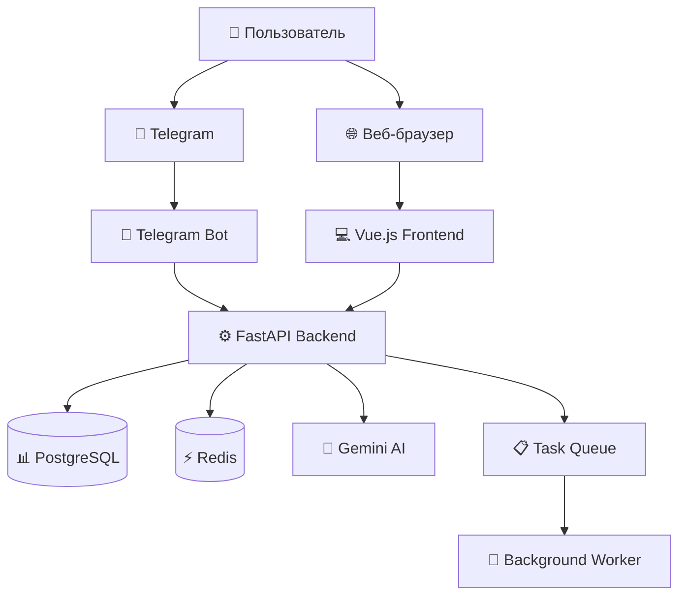

# 🤖 AI Mood Diary Bot

> Интеллектуальный Telegram бот для отслеживания настроения с анализом ИИ и веб-дашбордом

[](https://opensource.org/licenses/MIT)
[](https://www.python.org/downloads/)
[](https://vuejs.org/)
[](https://www.docker.com/)
[](https://fastapi.tiangolo.com/)

## 📋 Содержание

- [Описание проекта](#-описание-проекта)
- [Возможности](#-возможности)
- [Технологический стек](#-технологический-стек)
- [Архитектура](#-архитектура)
- [Быстрый старт](#-быстрый-старт)
- [Установка и настройка](#-установка-и-настройка)
- [Использование](#-использование)
- [API документация](#-api-документация)
- [Разработка](#-разработка)
- [Развертывание](#-развертывание)
- [Мониторинг](#-мониторинг)
- [Безопасность](#-безопасность)
- [FAQ](#-faq)
- [Участие в проекте](#-участие-в-проекте)
- [Лицензия](#-лицензия)

## 🎯 Описание проекта

**AI Mood Diary Bot** — это современное приложение для отслеживания эмоционального состояния, которое сочетает в себе удобный Telegram бот, мощный веб-интерфейс и искусственный интеллект для анализа настроения.

### Цель проекта
Помочь пользователям лучше понимать свои эмоциональные паттерны, отслеживать изменения настроения и получать персонализированные рекомендации для улучшения психологического благополучия.

### Кому подойдет
- 🧘 Людям, практикующим осознанность
- 📊 Тем, кто хочет анализировать свои эмоциональные паттерны
- 🏥 Пациентам, ведущим дневник настроения по рекомендации специалистов
- 📝 Всем, кто хочет лучше понимать себя

## ✨ Возможности

### 🤖 Telegram Bot
- **Интерактивное ведение дневника** - простое добавление записей через чат
- **Умные напоминания** - персонализированные уведомления
- **Быстрая статистика** - мгновенный доступ к ключевым метрикам
- **AI анализ в реальном времени** - немедленная обратная связь
- **Экспорт данных** - выгрузка истории в различных форматах

### 🌐 Веб-интерфейс
- **Детальная аналитика** - углубленный анализ эмоциональных паттернов
- **Интерактивные графики** - визуализация трендов и корреляций
- **Сравнение периодов** - анализ изменений во времени
- **Настраиваемые дашборды** - персонализация отображения данных
- **История записей** - полный доступ к архиву с фильтрацией
- **Управление профилем** - гибкие настройки и предпочтения

### 🧠 AI Анализ (Google Gemini)
- **Анализ эмоций** - определение эмоционального тона записей
- **Выявление паттернов** - обнаружение скрытых связей и тенденций
- **Персональные рекомендации** - советы на основе индивидуальных данных
- **Прогнозирование трендов** - предсказание будущих изменений настроения
- **Корреляционный анализ** - связь настроения с активностями и событиями

### 📊 Аналитика и отчеты
- **Мультиуровневая аналитика** - от дневных трендов до годовых паттернов
- **Сравнительные отчеты** - анализ прогресса во времени
- **Экспорт данных** - в форматах JSON, CSV, PDF
- **Интеграции** - возможность подключения внешних сервисов

## 🛠️ Технологический стек

### Backend
| Технология | Версия | Назначение |
|-----------|--------|------------|
| **FastAPI** | Latest | Основной веб-фреймворк |
| **SQLAlchemy** | 2.0+ | ORM для работы с БД |
| **PostgreSQL** | 15+ | Основная база данных |
| **Redis** | 7+ | Кэширование и сессии |
| **python-telegram-bot** | 20.7+ | Telegram Bot API |
| **Google Gemini AI** | Latest | Анализ эмоций |
| **Pydantic** | 2.5+ | Валидация данных |
| **Alembic** | Latest | Миграции БД |

### Frontend
| Технология | Версия | Назначение |
|-----------|--------|------------|
| **Vue.js** | 3+ | Frontend фреймворк |
| **Vuetify** | 3+ | UI компоненты |
| **Pinia** | Latest | Управление состоянием |
| **Chart.js** | Latest | Графики и визуализация |
| **Vue Router** | 4+ | Маршрутизация |
| **Axios** | Latest | HTTP клиент |
| **Vite** | Latest | Сборщик и dev сервер |

### DevOps & Infrastructure
| Технология | Назначение |
|-----------|------------|
| **Docker** | Контейнеризация |
| **Docker Compose** | Оркестрация сервисов |
| **Nginx** | Reverse proxy и веб-сервер |
| **GitHub Actions** | CI/CD pipeline |
| **Gunicorn** | WSGI сервер для продакшена |

## 🏗️ Архитектура



### Компоненты системы

1. **Telegram Bot** - точка входа для мобильных пользователей
2. **Vue.js Frontend** - веб-интерфейс для детальной аналитики
3. **FastAPI Backend** - API сервер с бизнес-логикой
4. **PostgreSQL** - основное хранилище данных
5. **Redis** - кэширование и очереди задач
6. **Gemini AI** - сервис анализа эмоций
7. **Nginx** - reverse proxy и статические файлы

**AI/ML компоненты:**
- **Google Gemini API integration** для анализа настроения
- **Full-stack approach**: Telegram bot + web dashboard
- **Data analytics pipeline** для mood tracking
- **FastAPI backend** с аналитическими отчетами

## 🚀 Быстрый старт

### Требования
- **Docker** 20.10+
- **Docker Compose** 2.0+
- **Git**
- **Make** (опционально, для удобства)

### За 3 шага

```bash
# 1. Клонируйте репозиторий
git clone https://github.com/R0D10Nq/ai-mood-diary-bot.git
cd ai-mood-diary-bot

# 2. Настройте окружение
cp .env.example .env
# Отредактируйте .env файл

# 3. Запустите проект
make dev
# или
docker-compose up -d
```

**Готово!** 🎉
- 🌐 Веб-интерфейс: http://localhost
- 🔧 API: http://localhost:8000
- 📚 Документация: http://localhost:8000/docs

## ⚙️ Установка и настройка

## Использование

### Telegram Bot команды:

- `/start` - начать работу с ботом
- `/mood` - записать настроение дня
- `/stats` - посмотреть краткую статистику
- `/help` - помощь по командам

### Веб-интерфейс:

Откройте http://localhost:3000 для доступа к dashboard с аналитикой.

## Структура проекта

```
ai-mood-diary-bot/
├── backend/                 # FastAPI backend
│   ├── app/
│   │   ├── api/            # API endpoints
│   │   ├── core/           # Настройки и конфигурация
│   │   ├── models/         # SQLAlchemy модели
│   │   ├── services/       # Бизнес-логика
│   │   └── bot/            # Telegram bot
│   ├── requirements.txt
│   └── main.py
├── frontend/               # Vue.js frontend
│   ├── src/
│   │   ├── components/     # Vue компоненты
│   │   ├── views/          # Страницы
│   │   ├── services/       # API сервисы
│   │   └── stores/         # Pinia stores
│   ├── package.json
│   └── vite.config.js
├── docker-compose.yml      # Docker конфигурация
├── .github/workflows/      # CI/CD pipeline
└── docs/                   # Документация
```

## API Документация

После запуска backend, API документация доступна по адресу:
- Swagger UI: http://localhost:8000/docs
- ReDoc: http://localhost:8000/redoc

## Разработка

### Настройка среды разработки:

1. Установите pre-commit hooks:
```bash
pip install pre-commit
pre-commit install
```

2. Запустите тесты:
```bash
# Backend тесты
cd backend
pytest

# Frontend тесты
cd frontend
npm run test
```

## Контрибьюция

1. Форкните проект
2. Создайте feature ветку (`git checkout -b feature/amazing-feature`)
3. Закоммитьте изменения (`git commit -m 'Добавил крутую фичу'`)
4. Запушьте в ветку (`git push origin feature/amazing-feature`)
5. Откройте Pull Request

## Лицензия

Этот проект распространяется под лицензией MIT. См. файл `LICENSE` для деталей.

## Автор

Разработано с ❤️ для демонстрации навыков middle-разработчика.

---

*Проект создан в образовательных целях и демонстрирует интеграцию современных технологий для создания full-stack приложения с ИИ.*
